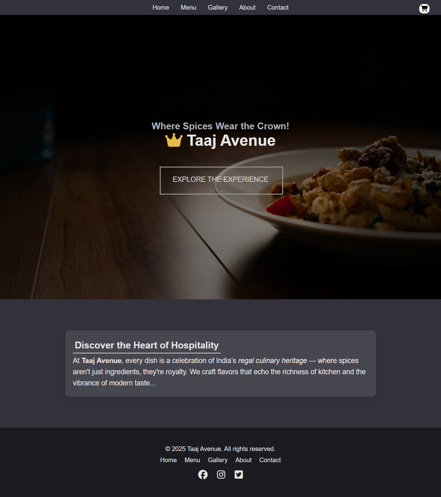
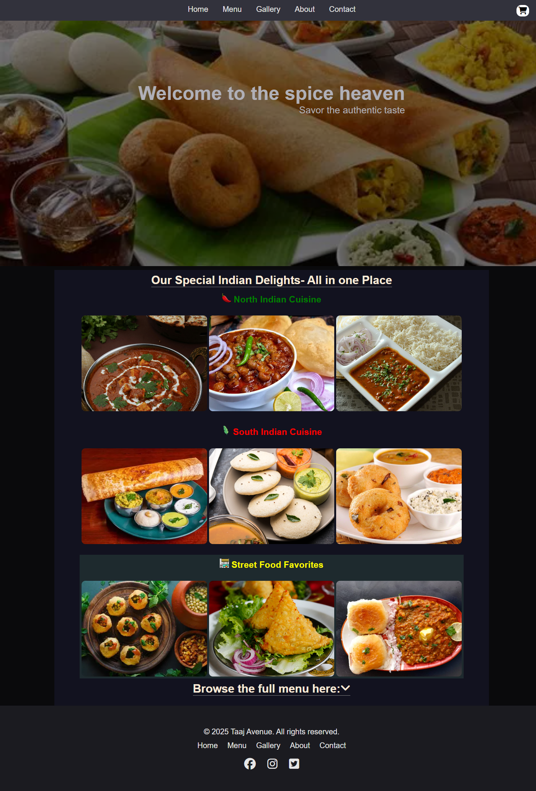

# Hotel-Website
A modern Hotel Website built using HTML, CSS, and JavaScript. This project showcases a platform where users can explore rooms, view amenities, and enjoy a food experience.
The goal of this project was to improve my frontend development skills, focusing on responsive design, layout structuring, and user experience.

live demo: hotel-website-gamma-jet.vercel.app

## Table of Contents
- [About](#about)
- [Features](#features)
- [Tech Stack](#tech-stack)
- [Screenshots](#screenshots)
- [Deployment](#deployment)
- [Future Improvements](#future-improvements)

## about
This is a responsive Hotel Website built using HTML, CSS, and JavaScript. The website displays hotel meal options along with their prices in a clean and user-friendly layout.
Users can browse different food items, view pricing details, and explore a modern hotel-style menu interface.
The main goal of this project was to improve my frontend development skills, especially in layout design, responsive UI, and JavaScript interactivity.

## features
- Responsive and modern UI design
- Display of hotel meals with prices
- Clean and user-friendly layout
- Interactive navigation between sections
- Well-structured menu presentation
- Mobile-friendly design for all screen sizes

## tech-stack
- HTML5 – Structure of the website  
- CSS3 – Styling and responsive design  
- JavaScript – Interactivity and functionality  
- Git & GitHub – Version control  
- Vercel – Deployment

## screenshots
### Home Page

### Menu Page

### Order page

## deployment
The project is hosted on Vercel for fast and reliable performance.
Live Demo: hotel-website-7jgeyaucm-sukhwinder-s-projects.vercel.app
Any updates pushed to the GitHub repository are automatically reflected in the live site through continuous deployment.

## future-improvements
- Build a cart system for adding and ordering meals
- Add dynamic price calculation based on selected items
- Convert the project into a full React.js web application
- Add authentication system for users
- Improve responsiveness and UI animations

  
